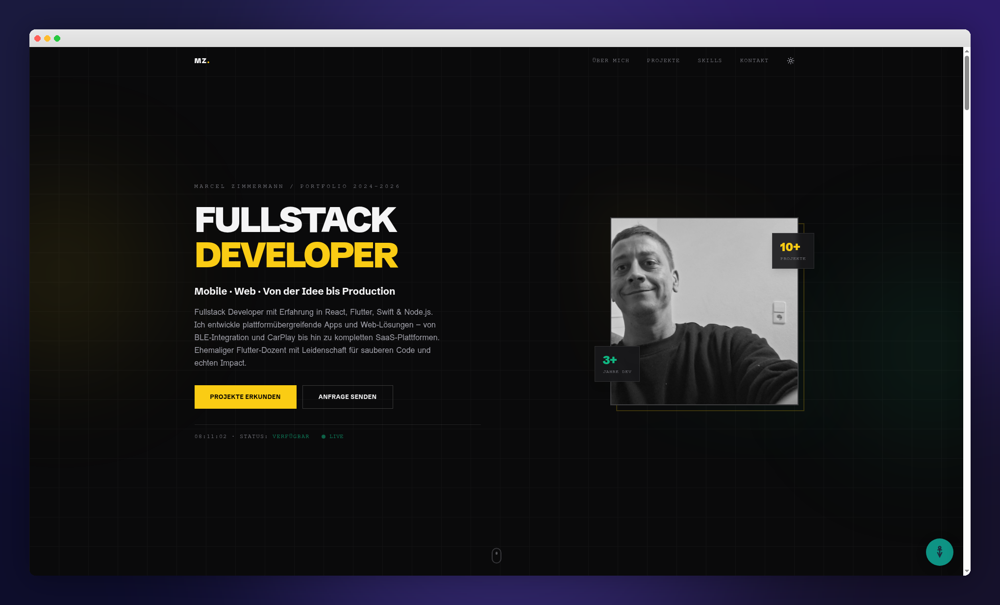
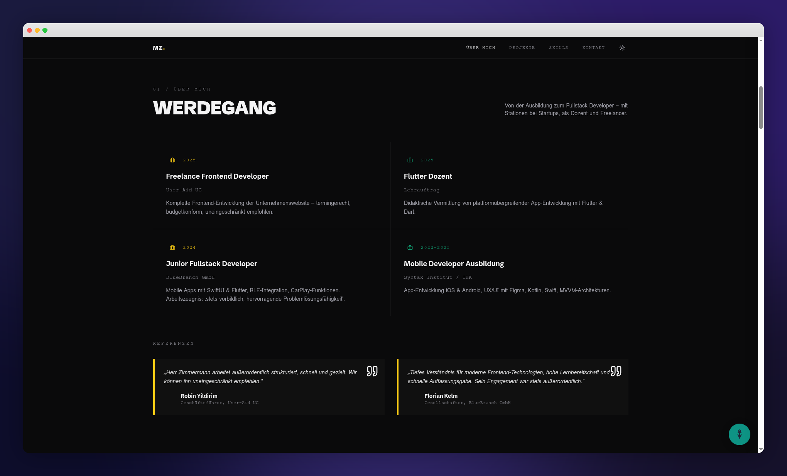
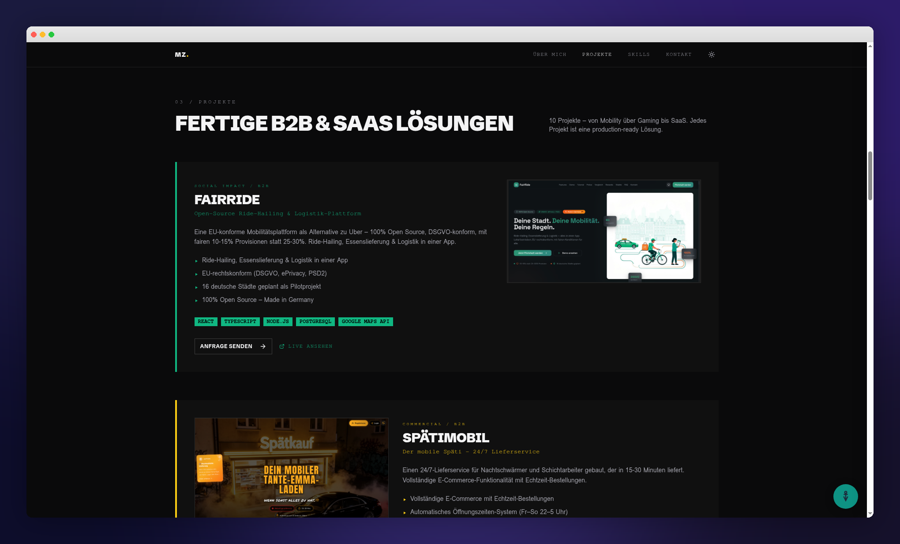
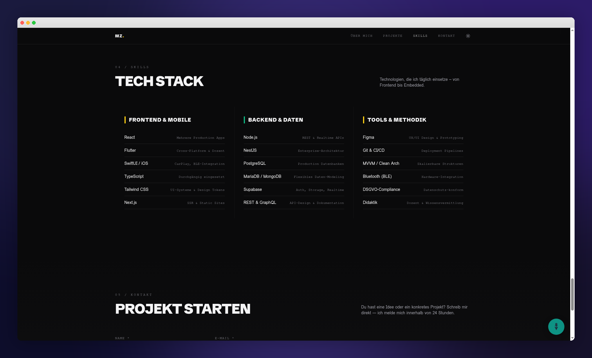
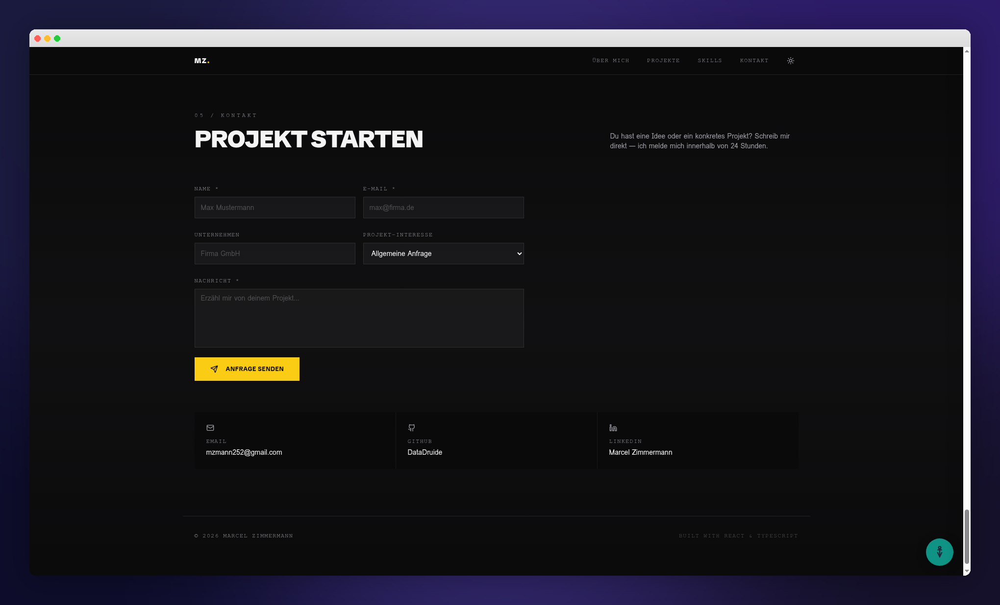

<p align="center">
  <strong>MZ.</strong>
</p>

<h1 align="center">Marcel Zimmermann — Fullstack Developer Portfolio</h1>

<p align="center">
  <em>Mobile · Web · Von der Idee bis Production</em>
</p>

<p align="center">
  <a href="https://code-craft-impact.lovable.app">🌐 Live Demo</a> &nbsp;·&nbsp;
  <a href="https://github.com/DataDruide">GitHub</a> &nbsp;·&nbsp;
  <a href="https://www.linkedin.com/in/marcel-zimmermann-bb8802211/">LinkedIn</a> &nbsp;·&nbsp;
  <a href="mailto:mzmann252@gmail.com">Kontakt</a>
</p>

<br />

<p align="center">
  
</p>

---

## 🚀 Über das Projekt

Ein modernes, performantes Developer-Portfolio – gebaut mit **React**, **TypeScript** und **Tailwind CSS**. Das Portfolio präsentiert 10+ production-ready B2B & SaaS Projekte mit interaktiven Showcases, Live-Statistiken und einem integrierten Kontaktformular mit Projekt-Auswahl.

### Highlights

- **🎨 Dark/Light Mode** – Vollständiges Theming mit semantischen Design Tokens
- **📱 Responsive Design** – Optimiert für Desktop, Tablet und Mobile
- **⚡ Performance** – Lazy Loading, Code Splitting, optimierte Assets
- **♿ Barrierefreiheit** – Integriertes AccessiWidget für WCAG-Konformität
- **📊 Live Dashboard** – Echtzeit-Statistiken zu Projekten und Technologien
- **📬 Kontaktformular** – Mit Projekt-Auswahl und Datenbank-Anbindung
- **🔐 Admin Panel** – Verwaltung von Projekten und Kontaktanfragen

---

## 📸 Screenshots

### Werdegang & Referenzen

<p align="center">
  
</p>

> Beruflicher Werdegang mit Stationen bei User-Aid UG, BlueBranch GmbH und Syntax Institut – inklusive verifizierter Referenzen.

### Projekte

<p align="center">
  
</p>

> 10 fertige Projekte – von Mobility (FairRide) über Gaming (Kampf um Mittelerde) bis IoT (SafeFloor®). Jedes Projekt mit Live-URL, Tech Stack und interaktiven Showcases.

### Tech Stack

<p align="center">
  
</p>

> Drei Kategorien: Frontend & Mobile, Backend & Daten, Tools & Methodik – mit konkreten Erfahrungswerten.

### Kontakt

<p align="center">
  
</p>

> Kontaktformular mit Projekt-Auswahl, das Anfragen direkt in der Datenbank speichert.

---

## 🛠 Tech Stack

| Kategorie | Technologien |
|-----------|-------------|
| **Frontend** | React 18, TypeScript, Tailwind CSS, Framer Motion |
| **UI Components** | shadcn/ui, Radix UI, Lucide Icons |
| **Backend** | Lovable Cloud (Supabase), Edge Functions |
| **Routing** | React Router v6 |
| **State** | TanStack React Query |
| **Build** | Vite 5, ESLint, Vitest |
| **Deployment** | Lovable Publish / Netlify |

---

## 📂 Projektstruktur

```
src/
├── assets/              # Screenshots & Bilder für Projekte
├── components/
│   ├── ui/              # shadcn/ui Komponenten
│   ├── HeroSection.tsx  # Hero mit Profilfoto & Animationen
│   ├── AboutSection.tsx # Werdegang & Referenzen
│   ├── ProjectsSection.tsx  # 10+ Projekt-Showcases
│   ├── SkillsSection.tsx    # Tech Stack Übersicht
│   ├── ContactSection.tsx   # Kontaktformular
│   ├── ContactForm.tsx      # Formular mit Projekt-Auswahl
│   ├── LiveDashboard.tsx    # Echtzeit-Statistiken
│   ├── Navbar.tsx           # Navigation mit Dark Mode Toggle
│   ├── PhoneCarousel.tsx    # Mobile App Showcase (Spätimobil)
│   └── AccessiPdfShowcase.tsx # AccessiWidget Showcase
├── contexts/
│   └── AuthContext.tsx  # Authentifizierung
├── pages/
│   ├── Index.tsx        # Landing Page
│   ├── Admin.tsx        # Admin Panel
│   └── Login.tsx        # Login
└── integrations/
    └── supabase/        # Datenbank-Client & Types
```

---

## 🎯 Enthaltene Projekte

| # | Projekt | Beschreibung | Typ |
|---|---------|-------------|-----|
| 1 | **FairRide** | Open-Source Ride-Hailing & Logistik-Plattform | 🟢 Social Impact |
| 2 | **Spätimobil** | 24/7 Lieferservice mit E-Commerce & App | 🟡 Commercial |
| 3 | **OpenForge** | Open-Source KI-App-Builder | 🟢 Social Impact |
| 4 | **Zeitwohnen München** | Plattform für möbliertes Wohnen auf Zeit | 🟡 Commercial |
| 5 | **Kampf um Mittelerde** | Browser-MMORTS-Strategiespiel | 🟡 Commercial |
| 6 | **AccessiWidget** | Barrierefreiheits-Widget für Websites | 🟢 Social Impact |
| 7 | **E-Gitarre Lernen** | Online-Lernplattform für E-Gitarre | 🟢 Social Impact |
| 8 | **Pflegefond Deutschland** | Hilfsplattform für pflegende Angehörige | 🟢 Social Impact |
| 9 | **SafeFloor®** | IoT Sturzfrühwarnsystem – Hardware & Software | 🟢 Social Impact |
| 10 | **Punzenverzeichnis** | B2B-SaaS für Goldschmiede & Silberschmiede | 🟡 Commercial |

---

## ⚡ Quick Start

```bash
# Repository klonen
git clone https://github.com/DataDruide/portfolio.git

# Abhängigkeiten installieren
npm install

# Entwicklungsserver starten
npm run dev
```

Die App ist dann unter `http://localhost:5173` erreichbar.

---

## 📬 Kontakt

<p align="center">
  <a href="mailto:mzmann252@gmail.com"><strong>📧 mzmann252@gmail.com</strong></a><br />
  <a href="https://github.com/DataDruide">🐙 GitHub – DataDruide</a><br />
  <a href="https://www.linkedin.com/in/marcel-zimmermann-bb8802211/">💼 LinkedIn – Marcel Zimmermann</a>
</p>

---

<p align="center">
  <sub>Built with React & TypeScript · © 2026 Marcel Zimmermann</sub>
</p>
